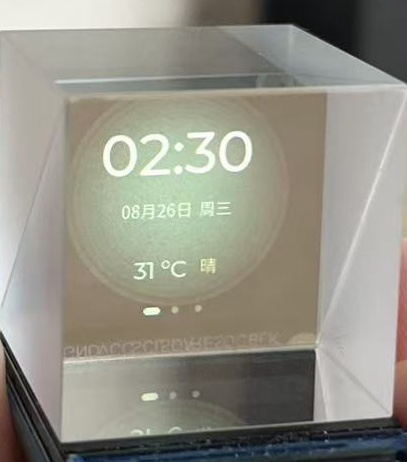
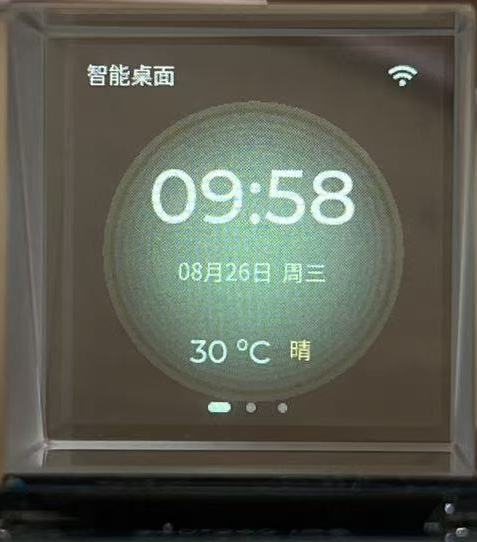
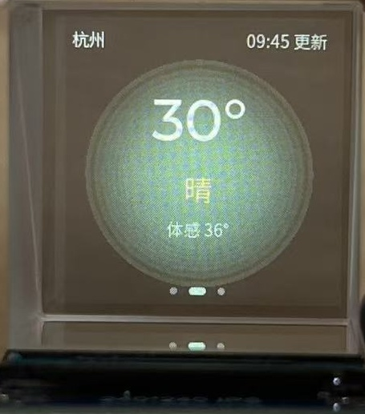
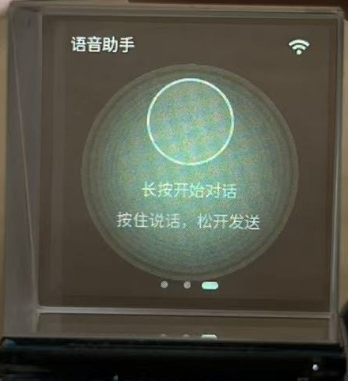
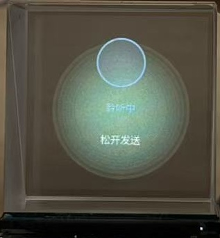
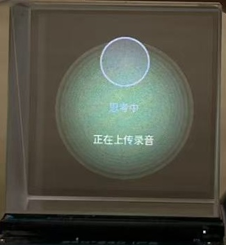
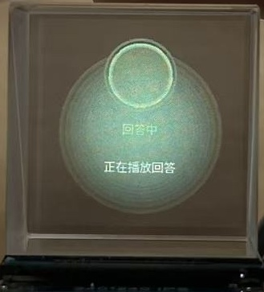
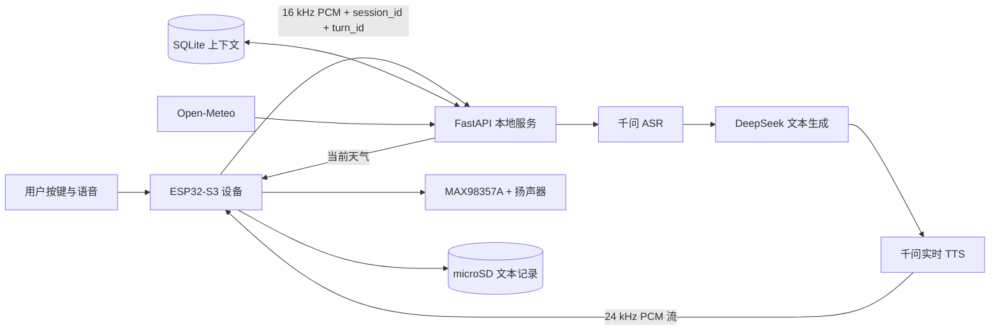

# AmbientDesk｜ESP32-S3 桌面语音助手

AmbientDesk 是一套可运行的桌面语音助手原型。ESP32-S3 负责按键交互、语音采集、流式音频播放、240×240 图形界面和 microSD 记录；本地 FastAPI 服务负责 ASR、上下文管理、DeepSeek 推理、实时 TTS 与天气数据聚合。

<p align="center">
  
</p>

## 已实现功能

| 模块 | 当前实现 | 验证状态 |
| --- | --- | --- |
| 显示 | ST7789 240×240 + LVGL 9；主页、天气页、语音页和语音状态覆盖层 | 已在实机显示 |
| 交互 | 单键短按切页；长按 500 ms 开始录音；松开发送 | 已在实机验证 |
| 录音 | INMP441，16 kHz、16 位、单声道；录音范围 1～20 秒 | 已在实机验证 |
| 语音链路 | 录音上传 → 千问 ASR → DeepSeek → 千问实时 TTS → ESP32 流式播放 | 已完成端到端实机验证 |
| 上下文 | SQLite 按 `session_id` 保存消息；每轮向 DeepSeek 提供最近 12 条消息 | 已在服务端验证 |
| 轮次隔离 | 设备生成 `turn_id`；播放前校验响应中的 `X-Turn-ID` | 已在代码中实现 |
| 网络信息 | Wi-Fi、SNTP 校时、Open-Meteo 当前天气；失败后重试，成功后定时刷新 | 已在实机验证 |
| 本地记录 | microSD 追加保存时间、用户文本和 AI 回答 | 已在实机验证 |

> “已实现”指当前仓库存在对应代码；“已在实机验证”指开发过程中已观察到目标屏幕、串口输出、音频或文件结果。仓库没有把尚未实现的功能写成现有能力。

## 实机界面

<p align="center">
  
  
  
</p>

<p align="center">
  
  
  
</p>

界面针对分光棱镜的反射方向进行显示翻转，并使用高对比度中心渐变，降低屏幕矩形边界在棱镜中的可见度。

## 系统架构



设备端不保存云端 API Key。密钥只存在于服务端环境变量中。完整职责边界、状态流和数据格式见 [系统架构](docs/ARCHITECTURE.md)。

## 交互流程

1. 短按按键在主页、天气页和语音页之间切换。
2. 长按 500 ms 进入“聆听中”；继续按住并说话。
3. 松开按键后停止录音，设备上传本轮 PCM。
4. 服务端依次完成 ASR、加载上下文、DeepSeek 回答和实时 TTS。
5. ESP32 收到足够的预缓冲音频后开始播放，完成后返回原页面。
6. 服务端将上下文写入 SQLite；设备随后获取本轮文字并追加到 microSD。

## 硬件基线

- ESP32-S3 N16R8 Nano：16 MB Flash、8 MB PSRAM
- ST7789 SPI TFT：1.3 英寸、240×240
- INMP441 I2S 数字麦克风
- MAX98357A I2S D 类功放与 4 Ω / 3 W 扬声器
- microSD SPI 模块与 microSD 卡
- 单个低电平有效实体按键
- 25.4 mm 分光棱镜

当前接线、GPIO、电源与 BTL 扬声器安全要求见 [硬件与接线](docs/HARDWARE_V1.md)。

## 软件栈

- 固件：ESP-IDF 6.0.2、LVGL 9.5、`esp_lvgl_port` 2.8
- 服务端：Python、FastAPI、SQLite
- 云服务：千问 ASR、DeepSeek Chat Completions、千问实时 TTS
- 天气：Open-Meteo

## 快速开始

### 1. 启动服务端

```bash
cd server
python3 -m venv .venv
source .venv/bin/activate
pip install -r requirements.txt
cp .env.example .env
```

在 `.env` 中填入自己的服务密钥、百炼兼容接口地址和天气位置。加载配置并启动：

```bash
set -a
source .env
set +a
uvicorn app:app --host 0.0.0.0 --port 8000
```

检查本地服务：

```bash
curl http://127.0.0.1:8000/health
curl http://127.0.0.1:8000/weather/current
```

### 2. 配置并编译固件

```bash
cp ambient_desk_firmware/main/wifi_credentials.example.h \
   ambient_desk_firmware/main/wifi_credentials.h
```

填写 2.4 GHz Wi-Fi 的 SSID 和密码，并把 `ambient_desk_firmware/main/app_network.c` 顶部的三个本地服务 URL 改为运行 FastAPI 的电脑局域网地址。

在 ESP-IDF 6.0.2 终端中执行：

```bash
cd ambient_desk_firmware
idf.py set-target esp32s3
idf.py build
idf.py flash monitor
```

固件烧录、服务端启动和实机验收步骤见 [演示与验证](docs/DEMO_AND_VERIFICATION.md)。

## 仓库结构

```text
ambient-desk/
├── ambient_desk_firmware/   ESP32-S3 固件
│   └── main/                显示、UI、按键、音频、网络、存储模块
├── server/                  FastAPI、ASR、DeepSeek、TTS、天气与上下文
├── docs/                    架构、硬件、日志、功能分析与演示说明
└── README.md
```

## 当前边界

以下内容没有在 V1 中实现：

- 语音打断播放、AEC 和全双工对话；
- 流式 ASR 或 DeepSeek 文本流；当前在完整录音识别和完整文本回答后启动实时 TTS；
- HTTPS/WSS 设备认证、远程部署和密钥轮换；
- Wi-Fi 配网界面和服务端地址持久化；当前两项在编译期配置；
- 多用户、多设备并发隔离；当前固件使用固定 `session_id`；
- 自动联网搜索、工具调用 Agent、长期记忆摘要和 SD 卡远程文件接口；
- 电池、摄像头、环境传感器、IMU 手势切页、定制 PCB 与成品外壳。

当前形态是面包板与模块化硬件组成的 V1 工程原型，目标是验证完整交互链路，不代表已经完成量产级电气、结构、认证或安全设计。

## 文档索引

- [系统架构与关键设计](docs/ARCHITECTURE.md)
- [硬件、接线与电气约束](docs/HARDWARE_V1.md)
- [演示与验证说明](docs/DEMO_AND_VERIFICATION.md)
- [功能分析与后续扩展](docs/FEATURE_ANALYSIS_AND_EXPANSION.md)
- [开发日志](docs/logs/README.md)
- [V1 实装 BOM](docs/BOM.csv)

## 许可与使用限制

本项目采用 [PolyForm Noncommercial License 1.0.0](LICENSE)，属于**源码可见（source-available）项目，不是 OSI 定义下的开源软件**。

- 允许个人学习、研究、实验和其他非商业用途；
- 允许在同一许可约束下，为非商业目的修改和分发；
- 未经版权所有者书面授权，禁止将本项目或其衍生作品用于任何预期商业用途；
- 仓库引用的 ESP-IDF、LVGL 及其他第三方组件，分别遵循其自身许可证，本许可证仅适用于本仓库中版权所有者有权许可的原创内容。

如需商业授权，请通过 GitHub 账号 `LighthouseXy` 联系版权所有者。
