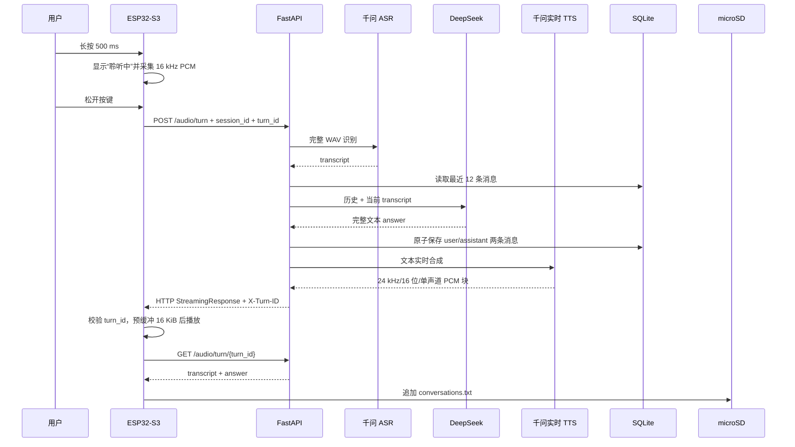

# VoxConductor V1 系统架构

最后更新：2026-08-26

本文只描述当前仓库已经实现的 V1 架构。规划中的联网搜索、工具调用 Agent、全双工语音和远程 SD 卡管理不属于当前实现。

## 1. 设计目标

V1 解决一个明确问题：使用单个 ESP32-S3 和本地服务，完成可重复演示的桌面语音交互闭环，同时保留天气、时间和本地会话记录。

设计取舍：

- ESP32-S3 只承担实时性明确的设备职责，不在 MCU 上运行 ASR、TTS 或大模型。
- API Key、上下文数据库和第三方 API 调用集中在电脑端 FastAPI 服务。
- 交互采用按键半双工，避免在 V1 中引入回声消除和误唤醒问题。
- 音频上行按完整录音提交；音频下行使用流式 PCM，减少等待完整 TTS 文件的时间。

## 2. 组件与职责

| 组件 | 职责 | 关键文件 |
| --- | --- | --- |
| 固件入口 | 初始化顺序、语音轮次任务、`turn_id` 生成 | `firmware/main/main.c` |
| 显示驱动 | ST7789、SPI2、LVGL 显示注册、棱镜方向补偿 | `app_display.c` |
| UI | 三个常驻页面、天气数据、Wi-Fi 状态、语音覆盖层与动画 | `app_ui.c` |
| 按键 | 20 ms 轮询、消抖、500 ms 长按、短按/长按事件 | `app_button.c` |
| 音频 | INMP441 采集、录音缓冲、音量计算、MAX98357A 播放 | `app_audio.c` |
| 网络 | Wi-Fi、天气、SNTP、语音上传、流式播放与轮次校验 | `app_network.c` |
| 存储 | microSD 挂载和 `conversations.txt` 追加写入 | `app_storage.c` |
| HTTP 服务 | 路由、音频格式校验、处理链编排、流式响应 | `server/app.py` |
| ASR | WAV 编码与千问 ASR 请求 | `server/asr_client.py` |
| LLM | 最近上下文组装与 DeepSeek 请求 | `server/deepseek_client.py` |
| TTS | 千问实时 TTS WebSocket 转 HTTP PCM 流 | `server/tts_client.py` |
| 上下文 | SQLite 消息保存、最近消息读取、会话清空 | `server/conversation_store.py` |
| 天气 | Open-Meteo 请求、天气码映射和 10 分钟缓存 | `server/weather_client.py` |

## 3. 一轮语音对话的数据流



上行不是流式 ASR：用户松开按键后，设备才提交完整 PCM。DeepSeek 也不是文本流：服务端取得完整回答后才启动实时 TTS。当前“流式”专指 TTS 音频块边生成、边下发、边播放。

## 4. 状态与页面

常驻页面：

1. 主页：时间、日期、Wi-Fi、当前温度和天气。
2. 天气页：城市、当前温度、天气、体感温度和更新时间。
3. 语音页：待机入口和操作提示。

语音状态覆盖层：

```text
待机 --长按--> 聆听 --松开--> 思考 --收到音频--> 回答 --完成--> 原页面
                              \--失败--> 错误 --3秒--> 原页面
```

语音轮次执行期间，短按切页被忽略，避免 UI 与正在处理的轮次竞争。当前没有实现播放中取消或语音打断。

## 5. 音频格式与缓冲

| 方向 | 格式 | 说明 |
| --- | --- | --- |
| 麦克风 → ESP32 | INMP441，I2S 32 位槽、左声道 | 固件去直流偏移并提取左声道 |
| ESP32 → 服务端 | 16 kHz、16 位、单声道原始 PCM | 1～20 秒；HTTP 请求体 |
| 服务端 → ESP32 | 24 kHz、16 位、单声道原始 PCM | HTTP 分块响应 |
| ESP32 → MAX98357A | 24 kHz、16 位、双声道 I2S | 单声道样本复制到左右槽 |

设备在播放前积累 16 KiB 音频，约等于 24 kHz、16 位、单声道的 341 ms。该预缓冲用于吸收局域网与 TTS 分块的短时抖动；它会增加固定的首播等待，但可降低播放断续概率。

## 6. 上下文与轮次一致性

- 固件当前使用固定 `session_id`：`voxconductor-01`。
- 每次长按创建新的 `turn_id`，组合 Unix 时间、启动内序号和 FreeRTOS tick。
- 服务端按 `session_id` 从 SQLite 读取最近 12 条消息，即最多 6 轮 user/assistant 对话。
- 模型成功回答后，服务端在一个数据库事务中保存本轮 user 和 assistant 消息。
- TTS 响应返回 `X-Turn-ID`；设备在播放数据前校验它是否等于当前轮次。
- 设备播放完成后，以相同 `session_id + turn_id` 获取文字结果并写入 microSD。

当前上下文是固定窗口，不包含摘要、长期记忆、工具调用结果或取消事件。SQLite 是服务端上下文的事实源；microSD 文本是设备侧副本，不参与当前模型提示词构建。

## 7. 网络与天气

- ESP32-S3 使用 2.4 GHz Wi-Fi STA 模式，首次连接最多重试 5 次。
- 固件通过 SNTP `pool.ntp.org` 获取时间并设置 UTC+8。
- 服务端调用 Open-Meteo，缓存当前天气 10 分钟。
- 固件首次请求失败时每 30 秒重试；成功后每 10 分钟刷新。
- FastAPI 的局域网地址当前编译在 `app_network.c` 中，不支持运行时配置。

## 8. 启动和故障降级

设备初始化顺序：显示 → UI → 按键 → microSD → 音频 → 音量监视 → Wi-Fi → 天气任务 → SNTP。

- 显示、UI、按键或音频初始化失败会终止正常启动。
- microSD 挂载失败只禁用设备侧文本记录，不阻止语音交互。
- Wi-Fi 连接失败会跳过联网功能；长按时 UI 明确显示网络错误。
- 天气失败不会阻止语音功能，天气任务按 30 秒间隔重试。
- ASR、DeepSeek、TTS、HTTP 或播放失败会显示错误状态，并在 3 秒后回到原页面。

## 9. V1 已知限制

- 服务端和设备之间使用局域网 HTTP，不具备传输加密和设备认证。
- 固件采用固定服务端 IP 和固定 `session_id`，不适合直接扩展为多设备产品。
- FastAPI 以 `latest.wav` 保存最近录音；并发请求需要改为按轮次隔离文件。
- `latest_turn` 是进程内全局变量，只服务于当前单设备开发场景。
- 没有播放取消、迟到任务主动取消、语音打断、VAD、唤醒词或 AEC。
- 没有持续运行、网络弱化、SD 卡满和掉电写入的系统化测试报告。

这些限制是后续工程化入口，当前仓库不将其记录为已实现能力。
